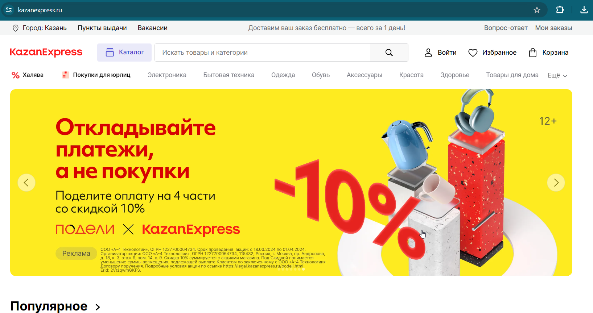
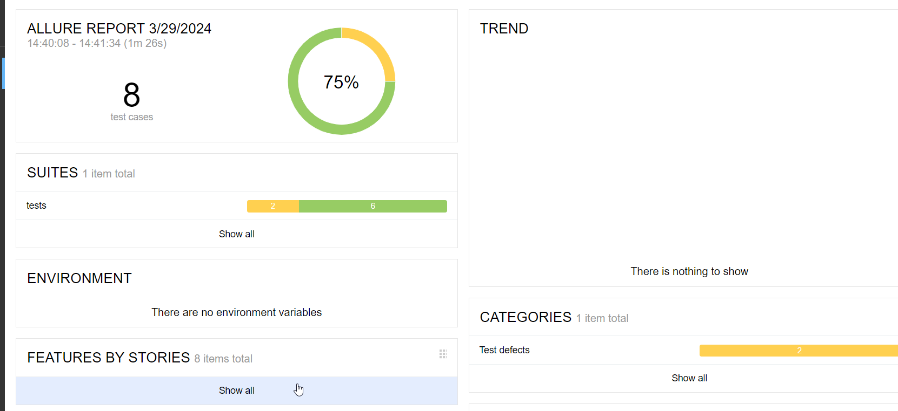
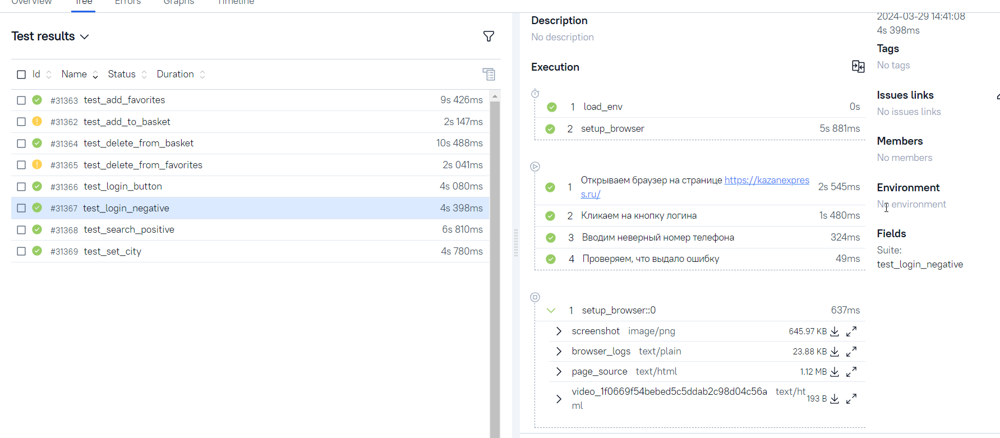
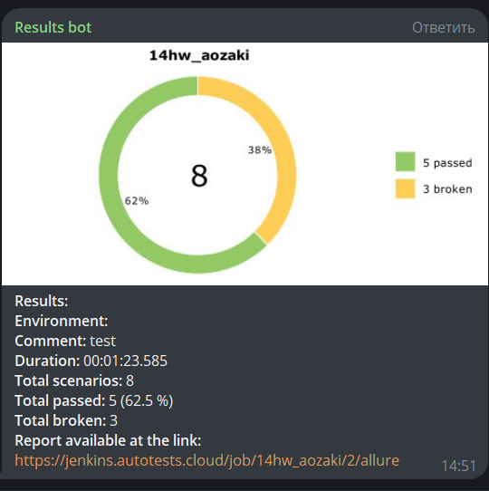

<h1> Проект по тестированию интернет-магазина "KazanExpress"</h1>

> <a target="_blank" href="https://kazanexpress.ru/">Ссылка на сайт</a>

----
### Проект реализован с использованием:
         

----

### Особенности проекта

* Оповещения о тестовых прогонах в Telegram
* Отчеты с видео, скриншотом, логами, исходной моделью разметки страницы
* Сборка проекта в Jenkins
* Отчеты Allure Report
* Интеграция с Allure TestOps
* Автоматизация отчетности о тестовых прогонах и тест-кейсах в Jira
* Запуск web/UI автотестов в Selenoid

 ### Список проверок, реализованных в web/UI автотестах

- [x] Смена города выполняется
- [x] Поиск по сайту выполняется
- [x] Открывается по-ап авторизации
- [x] Проверка валидации ввода номера телефона
- [x] Добавление товара в избранное
- [x] Удаление товара из избранного
- [x] Добавление товара в корзину
- [x] Удаление товара из корзины

----
### Локальный запуск
> Для локального запуска с дефолтными значениями необходимо выполнить команду:
```
python -m venv .venv
source .venv/bin/activate
pip install -r requirements.txt
pytest .
```
----
### Удаленный запуск автотестов выполняется на сервере Jenkins
> <a target="_blank" href="https://jenkins.autotests.cloud/job/test_kaz_sh/">Ссылка на проект в Jenkins</a>
#### Для запуска автотестов в Jenkins

1. Открыть <a target="_blank" href="https://jenkins.autotests.cloud/job/test_kaz_sh/">проект</a>
2. Нажать кнопку `Build`
3. Результат запуска сборки можно посмотреть в отчёте Allure
----
### Allure отчет


#### Общие результаты

#### Список тест кейсов в Allure TestOps

#### Нотификация в Telegram



